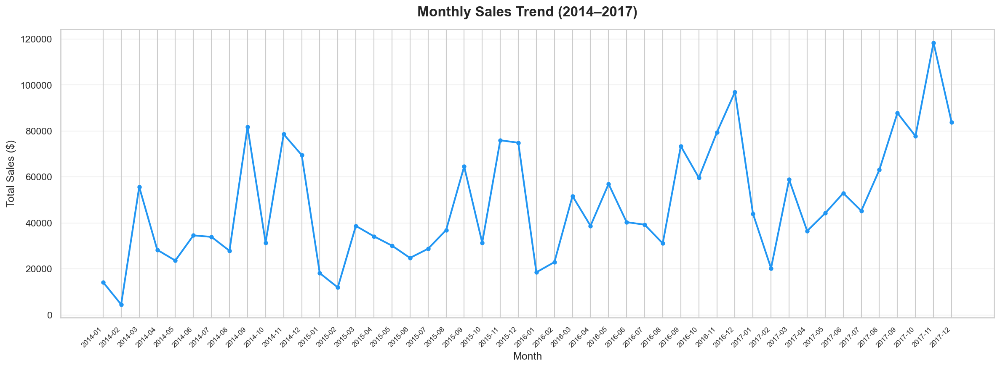
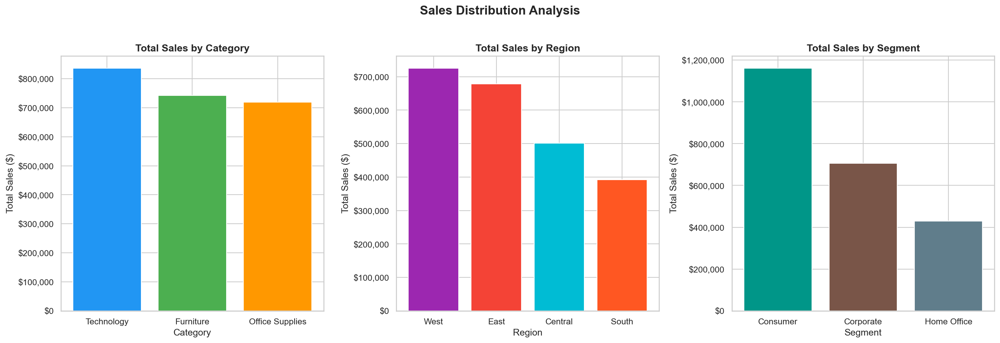
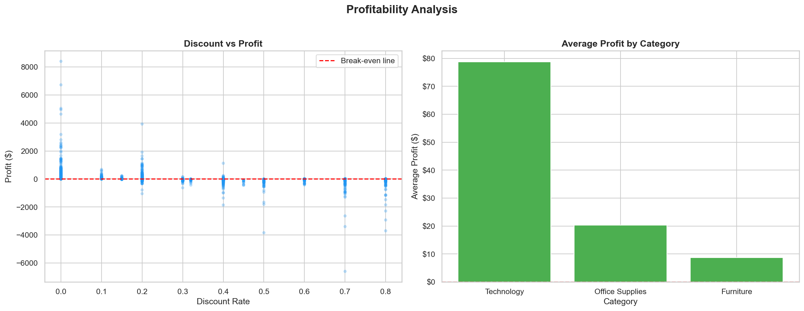
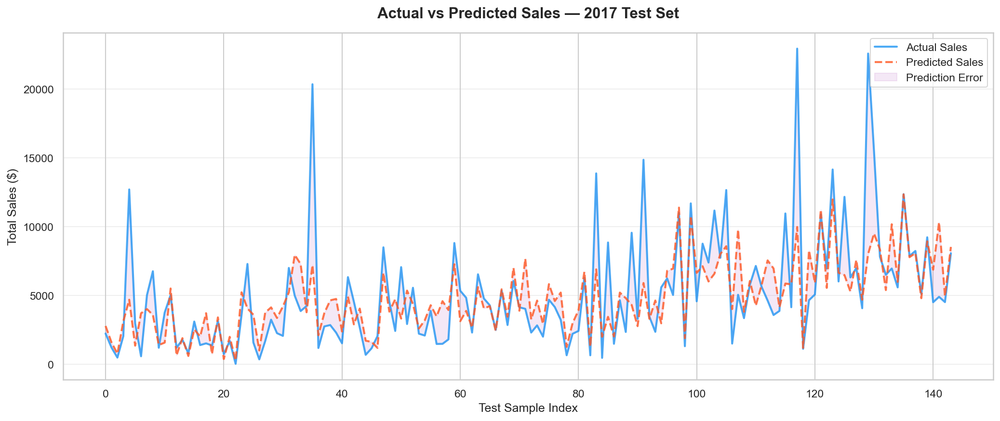
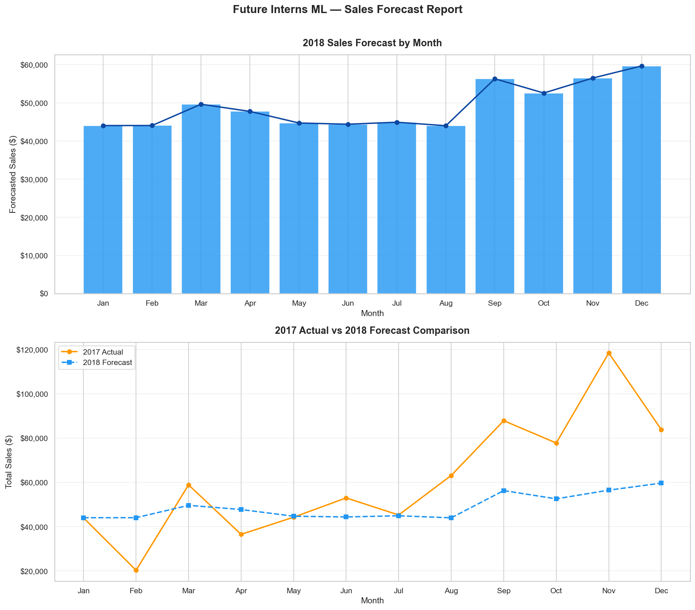
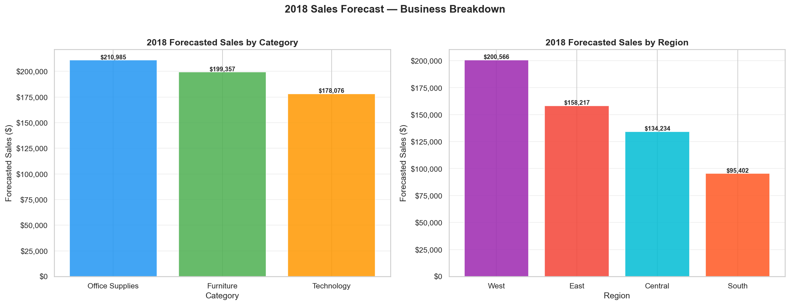

# 🛒 Sales & Demand Forecasting System
### Future Interns Machine Learning Internship — Task 1


---

## 📌 Project Overview

This project builds a **machine learning-powered sales forecasting system** using 4 years of 
real retail transaction data from a US Superstore (2014–2017). The system predicts future 
monthly sales by product category and region, providing actionable business intelligence 
that helps decision-makers plan inventory, manage cash flow, and identify growth opportunities.

> **Business Problem:** A retail superstore needs to predict future sales to avoid 
> overstocking, plan staffing, and optimise regional inventory allocation.

---

## 🎯 Objectives

- Clean and prepare 9,994 real-world retail transactions for ML
- Engineer time-based features capturing seasonality and business trends
- Build and evaluate a Random Forest forecasting model
- Generate a 2018 sales forecast by category and region
- Present findings in a clear, business-ready format

---

## 📊 Key Results

| Metric | Value |
|--------|-------|
| Model | Random Forest Regressor |
| Training Data | 2014–2016 (429 samples) |
| Test Data | 2017 (144 samples) |
| MAE | $1,859 per prediction |
| RMSE | $3,004 |
| R² Score | 0.4788 |
| 2018 Total Forecast | $588,418 |

---

## 💡 Business Insights Discovered

1. **Seasonality is real and predictable** — Sales consistently peak in Q4 
   (Nov–Dec) and drop sharply in January–February every year
2. **Discounting destroys profit** — Orders with discounts above 40% 
   almost always generate negative profit
3. **Technology is the most profitable category** — Despite Furniture having 
   high revenue, Technology generates the highest average profit per order ($78)
4. **The West region dominates** — West consistently outperforms all other 
   regions; the South represents an untapped growth opportunity
5. **Quantity drives revenue most** — Feature importance analysis shows 
   Total Quantity (41%) is the strongest predictor of sales

---

## 📈 Visualisations

### Monthly Sales Trend (2014–2017)


### Sales Distribution by Category, Region & Segment


### Profitability Analysis


### Actual vs Predicted Sales


### 2018 Sales Forecast


### 2018 Forecast by Category & Region


---

## 🗂️ Project Structure

FUTURE_ML_01/
│
├── data/                          # Raw dataset
│   └── Sample - Superstore.csv
│
├── notebooks/                     # Jupyter notebooks
│   ├── 01_EDA.ipynb               # Exploratory Data Analysis
│   └── 02_Model.ipynb             # Model building & forecasting
│
├── models/                        # Saved trained models
│   ├── sales_forecast_model.pkl
│   ├── category_encoder.pkl
│   └── region_encoder.pkl
│
├── reports/                       # All visualisation outputs
│   ├── 01_monthly_sales_trend.png
│   ├── 02_sales_distribution.png
│   ├── 03_profitability_analysis.png
│   ├── 04_actual_vs_predicted.png
│   ├── 05_2018_forecast.png
│   └── 06_forecast_by_category_region.png
│
├── requirements.txt
├── .gitignore
└── README.md

---

## 🛠️ Tech Stack

| Tool | Purpose |
|------|---------|
| Python 3.8 | Core programming language |
| Pandas | Data manipulation & aggregation |
| NumPy | Numerical computing |
| Scikit-learn | ML model training & evaluation |
| Matplotlib | Core visualisations |
| Seaborn | Statistical visualisations |
| Joblib | Model serialisation |
| Jupyter Notebook | Interactive development |

---

## 🚀 How to Run

```bash
# Clone the repository
git clone https://github.com/Russell-Mazambara/FUTURE_ML_01.git
cd FUTURE_ML_01

# Create and activate virtual environment
python3 -m venv venv
source venv/bin/activate

# Install dependencies
pip install -r requirements.txt

# Launch Jupyter
jupyter notebook
```

Then open `notebooks/01_EDA.ipynb` followed by `notebooks/02_Model.ipynb`.

---

## 📁 Dataset

**Superstore Sales Dataset** — Kaggle  
9,994 retail transactions across 4 years (2014–2017)  
21 features including Order Date, Sales, Profit, Category, Region, Discount  
Source: https://www.kaggle.com/datasets/vivek468/superstore-dataset-final

---

## 👤 Author

**Russell Mazambara**  
Machine Learning Intern — Future Interns  
CIN: FIT/APR26/ML7259